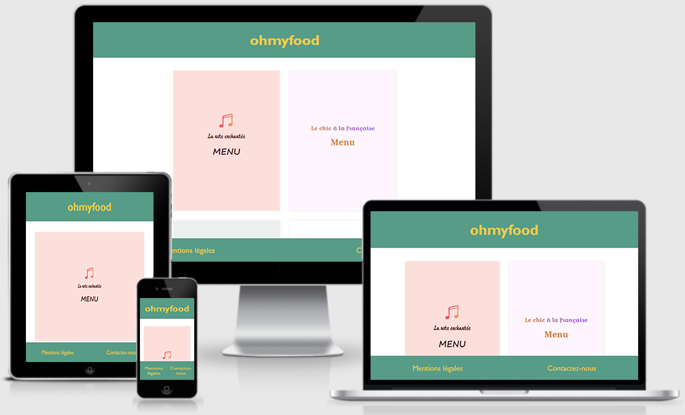

# Projet n°2 : Dynamiser une page web avec des animations CSS

## :mag: Aperçu

## :bookmark_tabs: Sommaire
<ol>
    <li><a href="#sujet">Sujet</a></li>
    <li><a href="#demandes_respecter">Demandes à respecter</a></li>
    <li><a href="#objectifs_projet">Objectifs du projet</a></li>
    <li><a href="#technologies_utilisees">Technologies utilisées</a></li>
    <li><a href="#prerequis">Prérequis</a></li>
    <li><a href="#installation">Installation</a></li>
    <li><a href="#utilisation_siteweb">Utilisation du site web</a></li>
    <li><a href="#auteurs_contributeurs">Auteurs et contributeurs</a></li>
    <li><a href="#licence">Licence</a></li>
</ol>

## :page_facing_up: 1. Sujet 

Vous venez d’être recruté chez Ohmyfood!, en tant que développeur junior. Félicitations !

Ohmyfood! est une jeune startup qui voudrait s'imposer sur le marché de la restauration. L'objectif est de développer un site 100% mobile qui répertorie les menus de restaurants gastronomiques. En plus des systèmes classiques de réservation, les clients pourront composer le menu de leur repas pour que les plats soient prêts à leur arrivée. Finis, les temps d'attente au restaurant !

Vous faites partie des 4 heureux élus qui ont la chance de travailler sur ce beau projet.

L’équipe se compose de :
- Paul, le CTO du futur site ;
- Fanny, l’UX designer recrutée pour mettre le site aux couleurs de Paris ;
- Anissa, commerciale chargée de démarcher les restaurants ;
- et vous, chargé du développement du site.
Anissa est en plein démarchage pour ce projet, auprès des restaurateurs. Elle vous interpelle à la machine à café :

Tu connais pas la nouvelle ? Tu te rappelles le responsable commercial de ton resto préféré ? J’ai réussi à le convaincre, avec 3 autres, de déposer leurs cartes en ligne ! Je t’envoie le dossier avec les 4 menus dans l’après-midi. À toi de jouer, maintenant !

Vous décidez alors, avec l’équipe, que le site contiendra 4 menus dans un premier temps. Voici le brief que vous établissez avec le CTO, Paul.

De retour à votre bureau, vous trouvez un mail de Fanny qui vous envoie les maquettes du site.

Pour ce projet, vous versionnez tout votre code sur Github avec des commits réguliers pour suivre son avancement et publier le site en ligne plus facilement.

Vous avez désormais tous les éléments pour construire ce site mobile. Vous vous lancez dans cette nouvelle aventure !

## :memo: 2. Demandes à respecter 

* Mettre en œuvre des effets CSS graphiques avancés.
* Assurer la cohérence graphique d'un site web.
* Mettre en place une structure de navigation pour un site web.

## :checkered_flag: 3. Objectifs du projet 

* Approfondir ses connaissances en HTML et CSS.
* Apprendre à utiliser le préprocesseur Sass.

## :computer: 4. Technologies utilisées 

* HTML
* CSS
* SASS
* Photoshop
* Git & GitHub

## :exclamation: 5. Prérequis 

Aucun

## :wrench: 6. Installation 

Cloner ce repository.

## :question: 7. Utilisation du site web 

Ouvrir le fichier index.html sur un navigateur web.

## :beers: 8. Auteurs et Contributeurs 

Timoté Lancelle : [GitHub](https://github.com/LancelleTimote) / [LinkedIn](https://www.linkedin.com/in/timote-lancelle-devweb/)

## :page_with_curl: 9. Licence 

Distribué sous la licence MIT. Voir le fichier [LICENSE](LICENSE) pour plus d'informations.